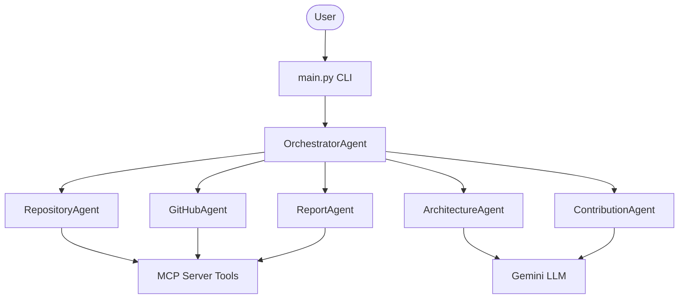

# RepoBuddy

> **Your Personal Open Source Mentor Agent**

RepoBuddy is an AI-powered agentic system designed to analyze public GitHub repositories and assist new or existing developers by generating detailed, mentor-focused documentation:
1. `ProjectAnalysis.md`: Structural insights, detected frameworks, and codebase complexity.
2. `ContributionRoadmap.md`: A tailored list of scored contribution opportunities accompanied by expert advice and custom learning paths.

---

## Features

- **Deterministic Context Gathering**: Accurately builds a snapshot of the repository by parsing the file tree, package manager configs, build systems, and entry points.
- **GitHub Intelligence**: Fetches real-time API metrics like health scores, recent commit frequency, open issues, pull requests, and maintainer responsiveness.
- **Architecture Synthesis**: Identifies structural patterns (MVC, Monolith, etc.) and analyzes testing and build strategies using Gemini.
- **Contribution Discovery**: AI-driven evaluation of 15 categories (Features, Refactoring, Documentation, etc.) to brainstorm and filter the best ~15 balanced recommendations.
- **Duplicate Risk Evaluation**: Cross-references new ideas against existing open issues/PRs to avoid duplicate work.
- **Mentor Advice & Learning Paths**: Each recommendation provides step-by-step guidance referencing actual files to help onboard developers seamlessly.

---

## Architecture Overview

RepoBuddy leverages Google's Agent Development Kit (ADK) and Model Context Protocol (MCP) to modularize codebase analysis.



### Agent Responsibilities

*   **OrchestratorAgent**: Directs execution sequencing, URL validation, temporary cloning, and robust error handling.
*   **RepositoryAgent**: Performs filesystem exploration (via MCP tools) to discover build tools, test directories, and entry points, and estimates complexity.
*   **GitHubAgent**: Communicates with the public GitHub API (via MCP tools) to extract issues, PRs, activity statistics, and computes Health Scores.
*   **ArchitectureAgent**: Uses Google's Agent Development Kit (ADK) and Gemini to identify structural patterns and frameworks based on summarized context.
*   **ContributionAgent**: Uses ADK and Gemini in a two-step flow (Brainstorming → Filtering) to generate scored opportunities and custom "Learning Paths".
*   **ReportAgent**: Standardizes markdown exports, generating the final deliverable files.

### MCP Tools

An implementation of a Model Context Protocol server exposing:
*   **Repository Tools**: `clone_repository`, `list_directory`, `read_file`, `detect_languages`, `search_files`.
*   **GitHub Tools**: `get_repository_metadata`, `get_open_issues`, `get_pull_requests`, `get_labels`, `get_recent_commits`, `get_contributors`, `get_repository_languages`, `get_repository_topics`, `get_repository_license`, `get_latest_release`, `get_default_branch`.
*   **Report Tools**: `save_markdown`.

---

## Project Structure

```text
RepoBuddy/
├── agents/                     # The 6 core agents driving the analysis
│   ├── architecture_agent.py
│   ├── contribution_agent.py
│   ├── github_agent.py
│   ├── orchestrator_agent.py
│   ├── report_agent.py
│   └── repository_agent.py
├── mcp_server/                 # MCP Server and 16 Tool Implementations
│   ├── server.py
│   ├── tools_github.py
│   ├── tools_report.py
│   └── tools_repository.py
├── models/                     # Pydantic v2 Models for structured data
│   ├── architecture_context.py
│   ├── contribution_context.py
│   ├── github_context.py
│   └── repository_context.py
├── reports/                    # Generated output documents (ProjectAnalysis.md, etc.)
├── main.py                     # CLI Entry Point
└── requirements.txt            # Dependency definitions
```

---

## Getting Started

### 1. Installation

Install the required Python modules:

```bash
pip install -r requirements.txt
```

### 2. Environment Variables

Copy the example configuration to your active `.env` file:

```bash
copy .env.example .env
```

Configure your credentials:
*   `GEMINI_API_KEY`: **Required**. Used by ArchitectureAgent and ContributionAgent for reasoning.
*   `GITHUB_TOKEN`: **Optional but Recommended**. Avoids strict anonymous GitHub API rate limits.

### 3. Usage

Run the Orchestrator demo via the CLI:

```bash
python main.py https://github.com/google/adk-python
```

You can pass any public GitHub repository URL as an argument.

### Example Output

```text
[ORCHESTRATOR] Instantiating OrchestratorAgent...

[ORCHESTRATOR] Starting mentorship flow for: https://github.com/google/adk-python
[ORCHESTRATOR] Created temporary workspace: C:\Temp\repobuddy_xxxx
[ORCHESTRATOR] Step 1: Cloning repository...
[ORCHESTRATOR] Step 2: Fetching GitHub intelligence...
[ORCHESTRATOR] Step 3: Performing architectural reasoning...
[ORCHESTRATOR] Step 4: Discovering contribution opportunities...
[ORCHESTRATOR] Step 5: Generating Markdown reports...
[ORCHESTRATOR] Cleaning up temporary workspace...

==============================================
✓ Orchestration run completed successfully!
----------------------------------------------
Deliverables:
1. Project Analysis: reports\ProjectAnalysis.md
2. Contribution Roadmap: reports\ContributionRoadmap.md
==============================================
```

---

## Limitations

- Currently relies on `git clone --depth 1` which requires a local installation of `git`.
- Large repositories with > 10,000 files may hit context limits depending on the Gemini model used (though summarized models actively prevent token explosion).

## Future Improvements

- **Interactive Mentoring Chat**: A chatbot that references the `ContributionRoadmap.md` and helps developers walk through the recommended learning paths.
- **Semantic Code Search**: Instead of basic string-based grep, implement a semantic search MCP tool for deeper issue-to-code resolution.
- **Auto-Draft PRs**: Integrate a sub-agent that drafts pull requests for Beginner-level "Good First Issues".
